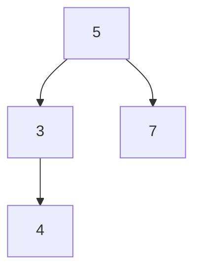
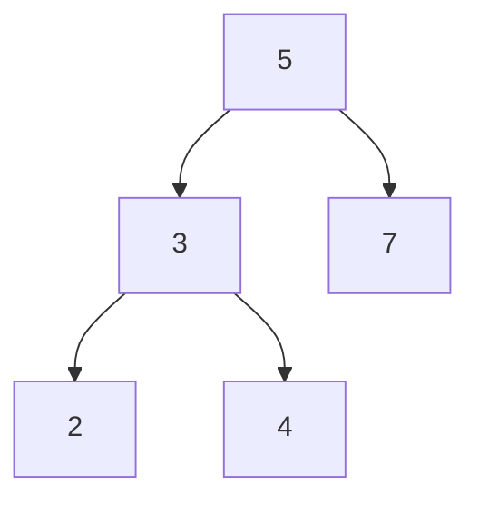
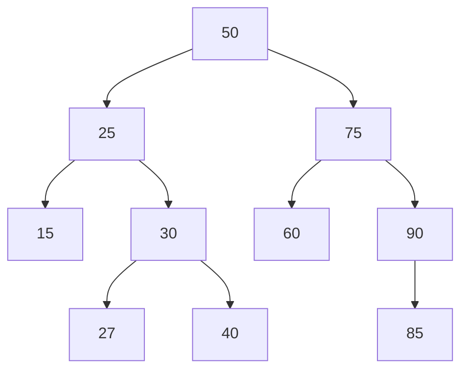
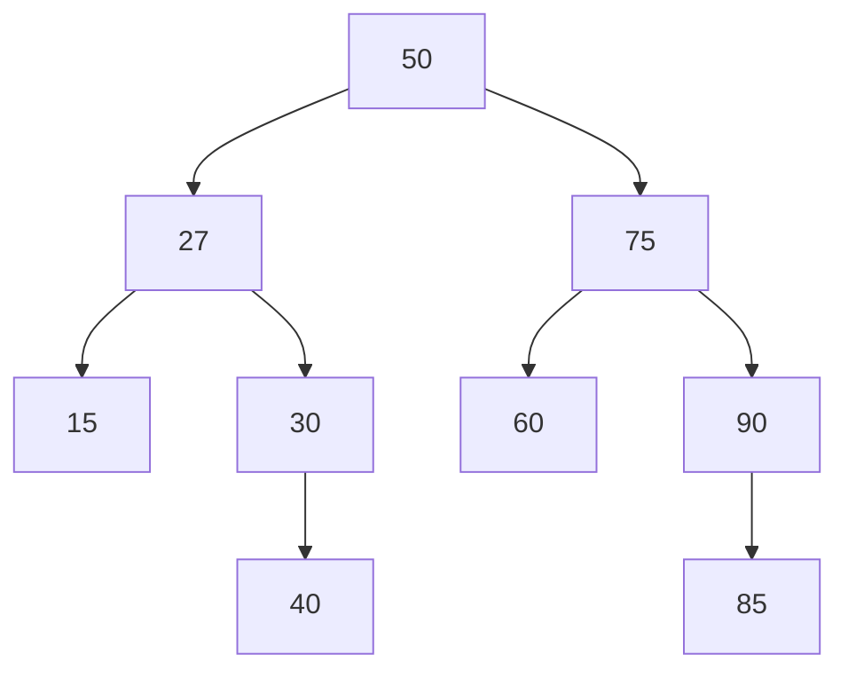
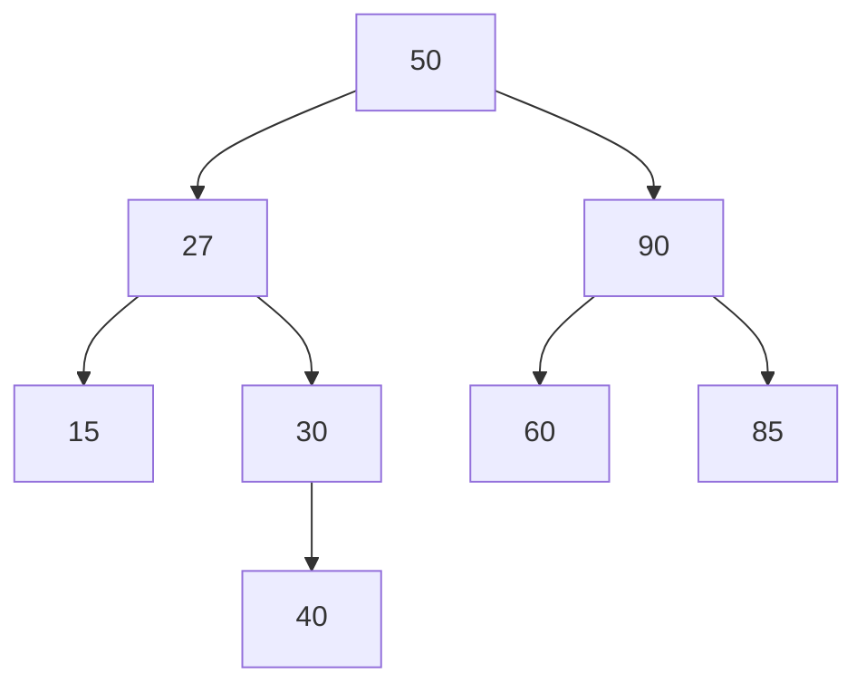
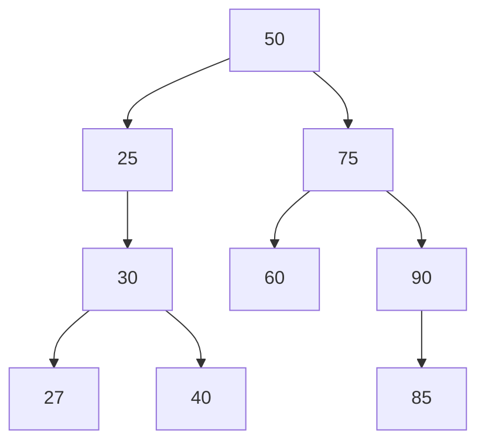
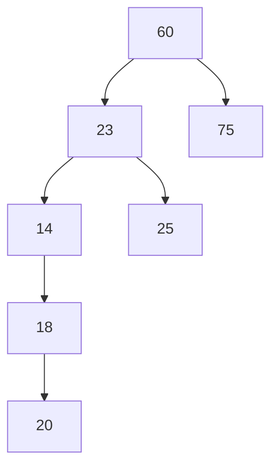
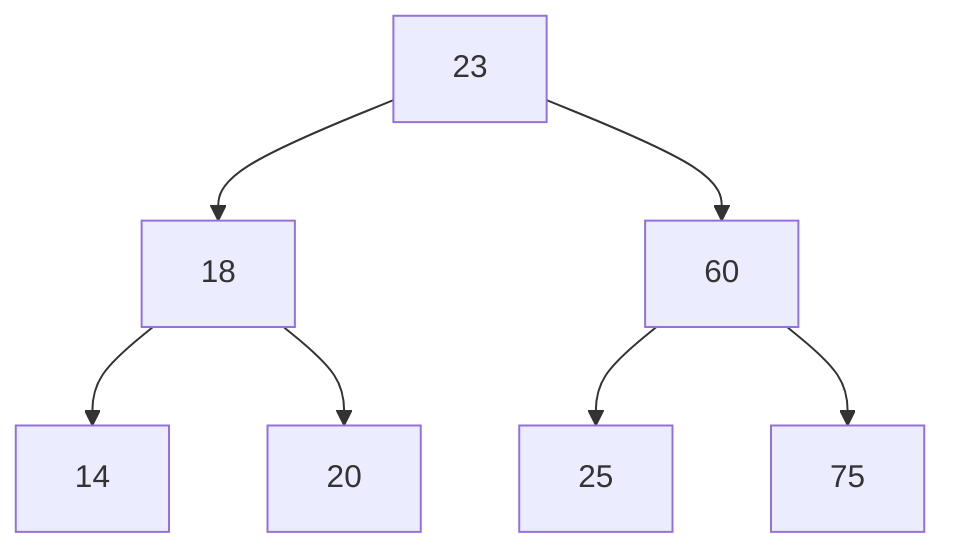
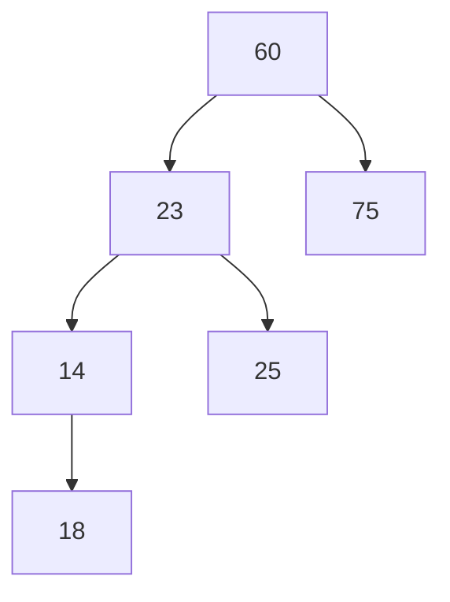
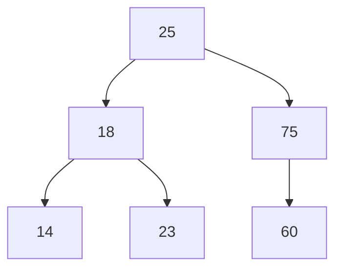

# Binary tree from python
---
- [x] Insertion a new node function in binary tree
- [x] Sorted bumber (Adding node)
- [x] Deletion a node function in binary tree
- [x] Balance node function in binary tree 
- [x] Find maximum height
- [x] Find parent (nodethat containnextleft orright node)
- [x] Find children (node that contain previous node)
- [x] Find leaves (node that does not contain next left or right node)
- [x] Find sibling (node that has the same parent)
- [ ] ...
---
 * function inside class :
```
class Node:
    def __init__(self,Val):
        self.Val = Val
        self.left = ""
        self.right = ""
```
code Insertion a new node and Sorted bumber :
```
header.append(number)
```
```
    def append(self,Val):
        while True:
            if Val > self.Val:
                if self.right == "":
                    self.right = Node(Val)
                    break
                else:
                    self = self.right
            if Val < self.Val:
                if self.left  == "":
                    self.left = Node(Val)
                    break
                else:
                    self = self.left
```
* diagrams Insertion a new node and Sorted bumber Ex:

> add number 2 :

---
Deletion a node <br />
```
header.delete(number)
```
```

def delete(self,Val):
        while True:
            if Val > self.Val:
                if self.right.Val == Val:
                    pre_temp = self
                    
                self = self.right
                    
            if Val < self.Val:
                if self.left.Val == Val:
                    pre_temp = self
                    
                self = self.left
            if Val == self.Val:
                break
        
        if self.right != "":
            temp = self.right
            if temp.left != "":
                while True:
                    if temp.left.left == "":
                        temp2 = temp.left.right
                        temp.left.left = self.left
                        temp.left.right = self.right
                        self = temp.left
                        temp.left = temp2
                        break
                    else:
                        temp = temp.left
            else:
                temp.left = self.left
                self = temp
                
        elif self.left != "" and self.right == "":
            self = self.left
            
        elif self.right == "" and self.left == "":
            self = ""
            
        if pre_temp.right != "":
            if pre_temp.right.Val == Val:
                pre_temp.right = self
        if pre_temp.left.Val == Val:
            pre_temp.left = self
```
* diagrams deletion a node Ex:

> case 1 (right -> left) delete number 25 :

> case 2 (right) delete number 75 :

> case 3 (left only) delete number 90 :

> case 4 (no children) delete number 15 :

---
* function outside class:<br />
 Balance node<br />
> > find inorder traversal first by code (inside class):
```
inorder = header.inorderTraversal(header)
```
```
def inorderTraversal(self, header):
            inorder = []
            if header:
                inorder = self.inorderTraversal(header.left)
                inorder.append(header.Val)
                inorder = inorder + self.inorderTraversal(header.right)
            return inorder
```
Ex output array inorder traversal: [60 ,23 ,75 ,14 ,25 ,18 ,20 ] --> [14 ,18 ,20 ,23 ,25 ,60 ,75 ]

---
> code balance node :
```
header = balance_tree(inorder,header)
```
```
def balance_tree_con(inorder,half,halftohalf,header):
    if header == "" or halftohalf == 0:
        return 0
    else:
        half_right = half + halftohalf
        half_left = half - halftohalf
        if half_right >= len(inorder):
            header.left = Node(inorder[half_left])
        else:
            header.right = Node(inorder[half_right])
            header.left = Node(inorder[half_left])
        halftohalf = round(halftohalf/2)

    return balance_tree_con(inorder,half_left,halftohalf,header.left) + balance_tree_con(inorder,half_right,halftohalf,header.right)

def balance_tree(inorder,header):
    Len = len(inorder)
    if Len % 2 == 0 :
        half = round(Len / 2)
    else:
        half = round((Len-1) / 2)
    header = Node(inorder[half])
    halftohalf = round(half/2)
    balance_tree_con(inorder,half,halftohalf,header)

    return header
```
* diagrams before balance odd node Ex:

> after balance  :

---
* diagrams before balance even node Ex:

> after balance  :

---
